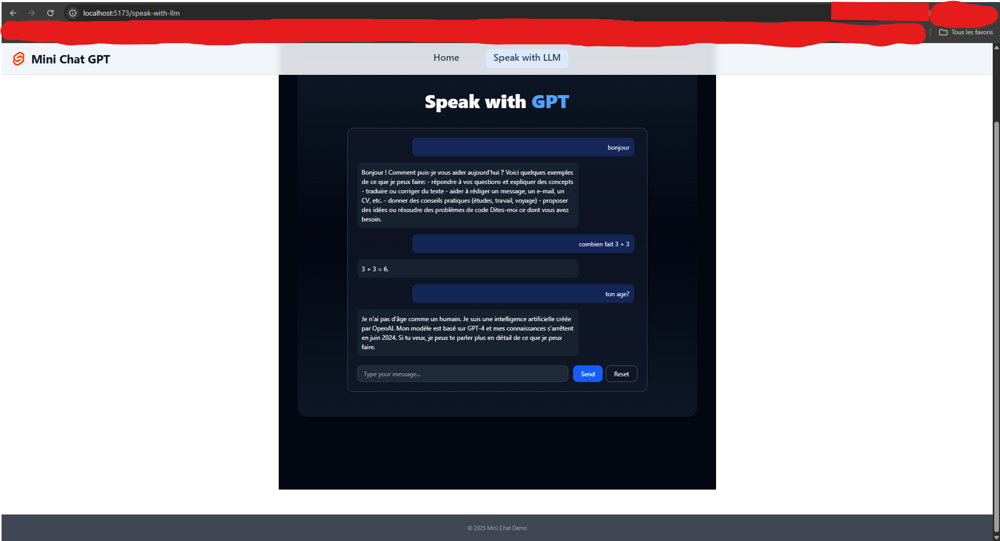
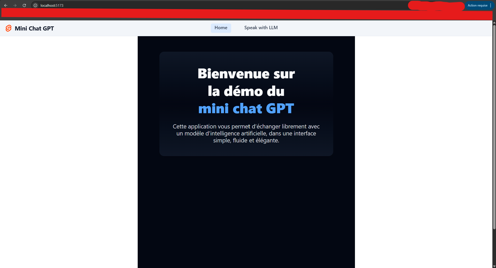

# Mini Chat GPT · SvelteKit Demo

A modern mini-chat application built with **SvelteKit**, **TypeScript**, **TailwindCSS**, and integration with **Supabase** and **OpenAI**. The project showcases a clean interface, global navigation, and a lightweight API to interact with a language model.




## 🎯 Learning Objectives

  - **SvelteKit Client & Server-Side**: Navigation, shared layout, and a custom API route to relay messages to the model.
  - **OpenAI Integration**: A ready-to-use `/api/chat` route using the `chat.completions` API.
  - **Optional Supabase**: Helpers are available to persist conversations (automatically disabled if the variables are not configured).
  - **Modern UI with Tailwind**: Sticky header, light/dark theme, and centered cards for the home and chat pages.
  - **TypeScript**: Strict typing on both front-end and back-end scripts to facilitate scalability.

-----

## 🧱 Architecture

```
src/
 ├─ lib/
 │   ├─ assets/                 → favicon & static assets
 │   └─ server/
 │        ├─ api_llm/openai.ts  → OpenAI client (chat completions)
 │        └─ supabase/client.ts → Supabase client and functions
 ├─ routes/
 │   ├─ +layout.svelte          → Navigation bar, light/dark theme
 │   ├─ +layout.ts              → Loads shared data (e.g. current path, user, settings)
 │   ├─ +page.svelte            → Home page
 │   ├─ speak-with-llm/
 │   │   ├─ +page.svelte        → Chat interface & form actions
 │   │   └─ +page.server.ts     → Load messages & save to DB actions
 │   └─ api/chat/+server.ts     → POST endpoint to relay messages to LLM
 └─ app.css / app.html          → Global styles & SvelteKit shell

```

-----

## 🚀 Quick Start

### 1\. Install Dependencies

```bash
npm install
```

### 2\. Environment Variables

Create a `.env` file at the root with the available keys:

```bash
OPENAI_API_KEY="sk-..."
OPENAI_API_MODEL="gpt-4o-mini"
PUBLIC_SUPABASE_URL="https://xxxx.supabase.co"
PUBLIC_SUPABASE_ANON_KEY="public-anon-key"
```

  - Without an OpenAI key, the API response will return a controlled error on the UI side.
  - If Supabase is not configured, the helpers are simply not called.

### 3\. Launch the Application

```bash
npm run dev -- --open
```

The SvelteKit development server runs by default on `http://localhost:5173`.

### 4\. Production Build

```bash
npm run build
npm run preview
```

Then, deploy to the hosting provider of your choice (requires the appropriate SvelteKit adapter for the target).

-----

## 💬 User Journey

1.  **Homepage**: An introduction to the project and a call-to-action (CTA) to the chat space.
2.  **"Speak with LLM" Page**: Input field, messages aligned according to their role, and a generation indicator.
3.  **`/api/chat` Route**: Receives the message, calls OpenAI, and returns the JSON response.
4.  **Theme Switcher**: Toggles between light and dark mode, with the choice persisted via `localStorage`.

-----

## 🧑‍🎨 Experience & UI

  - Responsive layout adapted for both desktop and mobile.
  - Translucent header and footer with active states on navigation links.
  - Soft gradients, rounded cards, and light shadows for comfortable reading.
  - Animated loading indicator while the assistant is generating a response.
