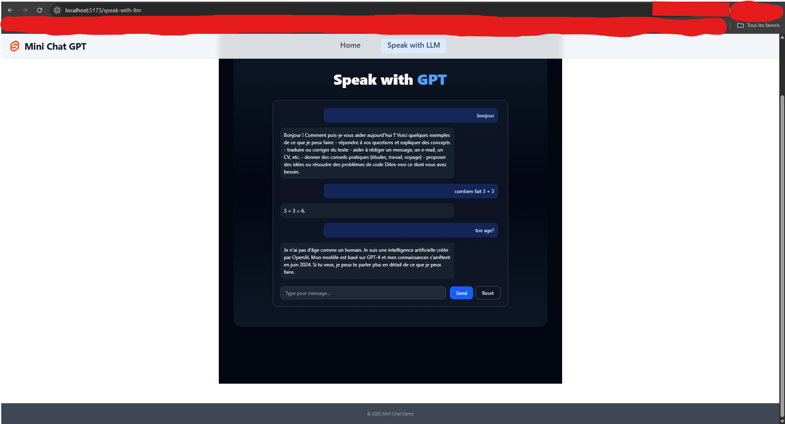
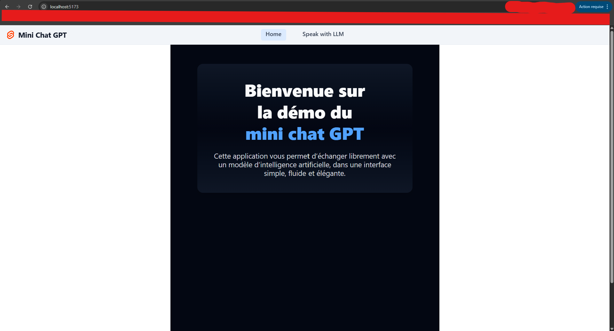

# Mini Chat GPT · SvelteKit Demo

Une mini application de chat moderne construite avec **SvelteKit**, **TypeScript**, **TailwindCSS** et une intégration optionnelle avec **Supabase** et **OpenAI**. Le projet met en avant une interface claire, une navigation globale et une API légère pour interagir avec un modèle de langage.




> Ajoute une capture d’écran dans `docs/app-preview.png` pour afficher l’aperçu ci-dessus.

## 🎯 Objectifs pédagogiques

- **SvelteKit côté client & serveur** : navigation, layout partagé et route API personnalisée pour relayer les messages au modèle.
- **Intégration OpenAI** : route `/api/chat` prête à l’emploi utilisant l’API `chat.completions`.
- **Supabase en option** : helpers disponibles pour persister les conversations (désactivés automatiquement si les variables ne sont pas configurées).
- **UI moderne avec Tailwind** : header collant, thème clair/sombre et cartes centrées pour les pages d’accueil et de chat.
- **TypeScript** : typage strict sur les scripts front et back pour faciliter l’évolution.

## 🧱 Architecture

```
src/
 ├─ lib/
 │   ├─ assets/                 → favicon & ressources statiques
 │   └─ server/
 │        ├─ api_llm/openai.ts  → client OpenAI (chat completions)
 │        └─ supabase/client.ts → helpers Supabase facultatifs
 ├─ routes/
 │   ├─ +layout.svelte          → barre de navigation, thème clair/sombre
 │   ├─ +page.svelte            → page d’accueil
 │   ├─ speak-with-llm/         → interface de chat (client-side fetch)
 │   │   └─ +page.svelte
 │   └─ api/chat/+server.ts     → endpoint POST pour relayer les messages
 └─ app.css / app.html          → styles globaux & shell SvelteKit
```

## 🚀 Démarrage rapide

### 1. Installer les dépendances

```bash
npm install
```

### 2. Variables d’environnement

Crée un fichier `.env` à la racine avec les clés disponibles :

```bash
OPENAI_API_KEY="sk-..."
OPENAI_API_MODEL="gpt-4o-mini"
PUBLIC_SUPABASE_URL="https://xxxx.supabase.co"
PUBLIC_SUPABASE_ANON_KEY="public-anon-key"
```

- Sans clé OpenAI, la réponse de l’API renverra une erreur contrôlée côté interface.
- Si Supabase n’est pas configuré, les helpers ne sont simplement pas appelés.

### 3. Lancer l’application

```bash
npm run dev -- --open
```

Le serveur de développement SvelteKit tourne par défaut sur `http://localhost:5173`.

### 4. Build de production

```bash
npm run build
npm run preview
```

Déploie ensuite sur l’hébergeur de ton choix (adapter SvelteKit requis selon la cible).

## 💬 Parcours utilisateur

1. **Accueil** : introduction au projet et CTA vers l’espace de discussion.
2. **Page “Speak with LLM”** : champ de saisie, messages alignés selon leur rôle et indicateur de génération.
3. **Route `/api/chat`** : reçoit le message, appelle OpenAI et renvoie la réponse JSON.
4. **Theme switcher** : bascule clair/sombre persisté via `localStorage`.

## 🧑‍🎨 Expérience & UI

- Layout responsive adapté desktop/mobile.
- Header et footer translucides avec états actifs sur la navigation.
- Dégradés doux, cartes arrondies et ombres légères pour une lecture confortable.
- Indicateur de chargement animé pendant la génération côté assistant.

## 🤝 Contributions & idées

1. Fork le projet puis crée une branche dédiée.
2. Ajoute tes modifications et les tests éventuels.
3. Ouvre une pull request détaillant les choix techniques.

N’hésite pas à suggérer d’autres intégrations (auth, historique, drizzled schema, etc.). Bonne exploration ! 🚀
